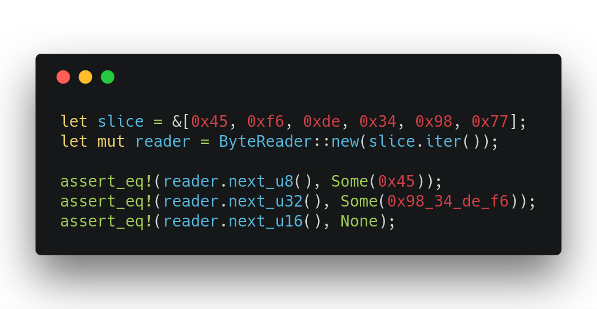

# `bytes_iter`
A smol utility crate for taking any `Iterator<Item=&u8>` and taking a mixture of the next `u8`, `u16`, `u32` and `u64`s from it. Useful for parsing binary formats.

### Example

### License
`bytes-iter` is dual licensed under:
* The Apache License, Version 2.0 (https://www.apache.org/licenses/LICENCE-2.0)
* The MIT License (https://opensource.org/licenses/MIT)

Unless you explicitly state otherwise, any contribution submitted for inclusion in this work by you, as defined in the Apache-2.0 license, shall be dual licensed as above, without additional terms or conditions.
